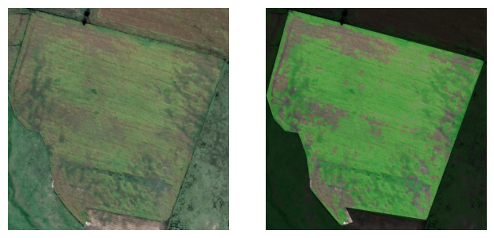
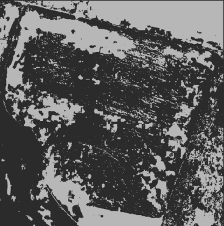
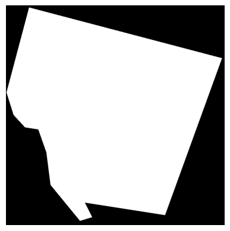
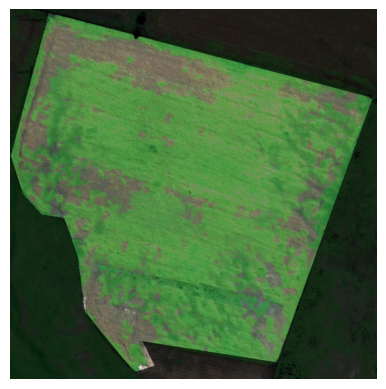

# Analyse Crop Image
Based on an input satellite image check what percentage is green surface.
The user can select which area to analyse, and based on the colors in the picture analyse where there are crops and where there is an empyt patch.

Here we can see an example of a satellite picture where the green surface area is of  70.4%

## How It Works

The process behind this image analysis algorithm involves several steps to extract and manipulate specific color information from an image. Here's a detailed overview of the process:

1. **HSV Color Threshold Selection:** To identify the target color range accurately, we employ the HSV color model. You can fine-tune the color thresholds to define the desired color range. For assistance, you can utilize the helpful [HSV Boundaries Helper](color_hsv_boundaries_helper.py) tool.

2. **Conversion to HSV Colors:** The input image is converted from its original color space to the HSV color space. This conversion allows us to separate the color information into distinct channels: Hue, Saturation, and Value.

3. **Color Filtering:** By applying the selected HSV color thresholds, we filter out all colors that fall outside the specified range. This step helps isolate the desired color(s) from the rest of the image.

4. **Area Selection:** From the filtered color mask, we can define and extract the specific region or area of interest that we want to analyze further. This step ensures that subsequent calculations are performed only on the relevant portion of the image.

5. **Green Percentage Calculation and Output Generation:** With the desired area isolated, we calculate the green percentage by analyzing the proportion of green pixels within that region. Using this information, we generate an output picture that visually represents the original image with the calculated green percentage overlaid.

This comprehensive image analysis process enables accurate color analysis, precise area selection, and percentage calculation, empowering you to gain valuable insights from the images you analyze.

## How to Run It

To run this image filtering algorithm, follow these steps:

1. **Prepare Your Images:** Ensure that your images are ready for processing. We recommend placing them inside the [Images](Images) folder within the project directory.

2. **Execute the File:** Open and execute the [Filter Image](demo_file.ipynb) file. This file contains the necessary code to run the image filtering algorithm.

3. **Select the Image:** Within the notebook, locate the variable `input_image_path` and modify it to specify the path of the image you want to process. This step allows you to choose the image you want to apply the filtering algorithm to.

4. **Select the Borders:** The notebook will prompt you to select the borders of your image. This step enables you to define the area or lot you want to focus on for further analysis.

5. **View the Results:** Once the algorithm has completed its processing, you can find the results in the last cells of the notebook. These results may include visual representations, data analysis, or any other outputs generated by the algorithm.

By following these steps, you can successfully run the image filtering algorithm and obtain the desired results for your images.
